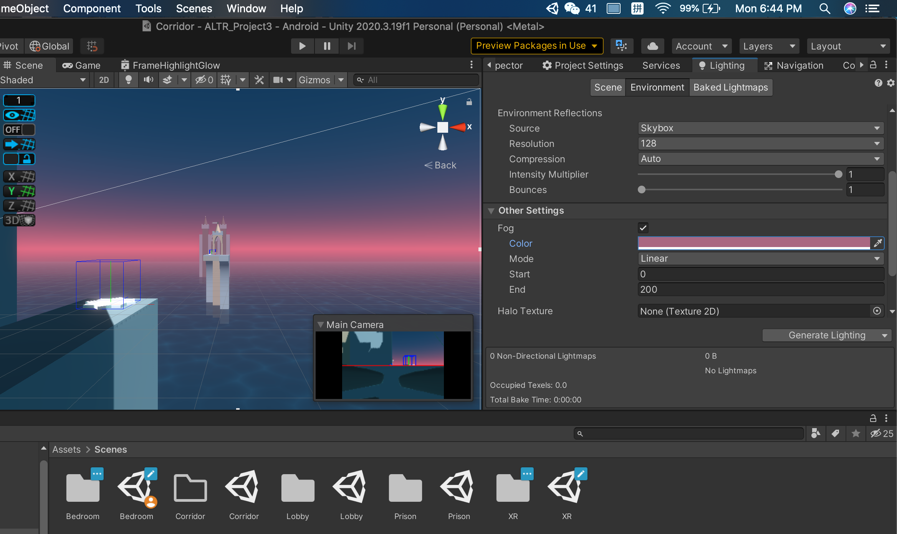
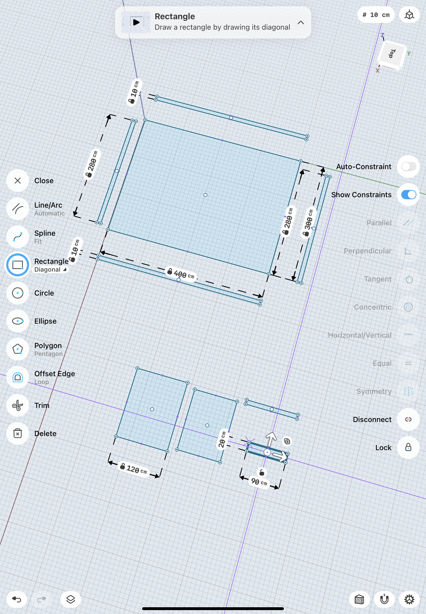
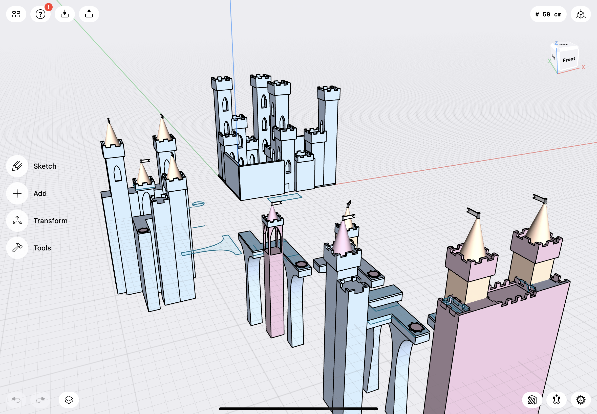
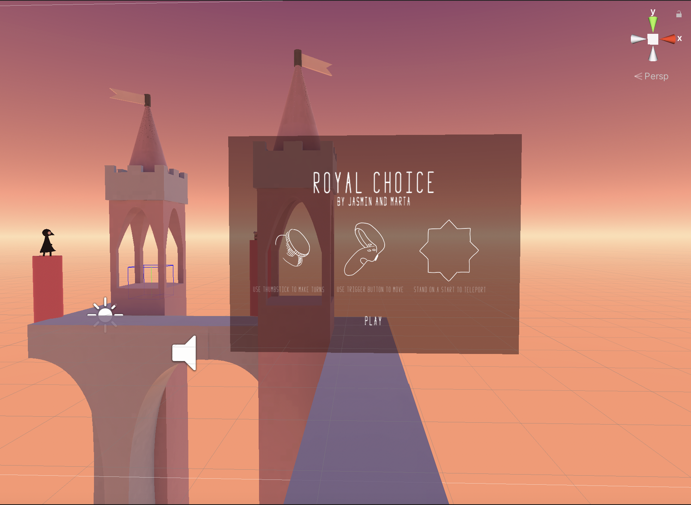

# Royal Choice

Alternate Realities Project by Marta Pienkosz and Jasmin Shi. 

## Worldbuilding
The main character of the story is a little princess, a member of the royal family. The royal family is elected by **dynastic and divine laws** and has partial immortality. Rulers are able to live up to 300 years, guaranteeing long-term prosperity and justice to their subjects.
 
The theme communicated by history revolves around the age-old moral dilemma - what's better, do a **good thing for a bad result** or do a **bad thing for a good result?**
 
 
## Plot
The little princess wakes up in her chamber. At the beginning of the story, we learn about the identity of the princess and her role in the royal family. Suddenly we hear a sound resembling a bird crying and together with the princess we decide to follow the sound and investigate where it comes from. The princess leaves her room and moves down the corridor towards the basement of the castle. The sound of flapping birds' wings intensifies.
 
In the basement, she discovers a room full of cages and learns that a special serum is obtained from magical birds. The princess realizes that she consumes a drink that grants “immortality” every day. She talks to an employee who explains the king's logic behind abusing the birds. Confused, she doesn't know what to do - she is faced with the decision to release the birds and expose the king's secret, or keep this information to herself.
 
 
## Progress
After brainstorming the project idea, we wrote a brief list of features we want to develop over the next 7 weeks, agreed on the order of implementation and minimal requirements for the MVP. Marta started our project by creating her own resources using [Shapr3D Software](https://www.shapr3d.com/)for each scene. Jasmin worked in parallel on the Github Collaborate and XR Rig setup, as well as creating scene transitions.

## Lobby
We have implemented a simple UI system in the lobby that shows the title, authors, and a brief instruction. We have designed the user path in a way that the user can learn to navigate in a VR environment, try the SnapTurn on turns, test RayCast interactions, and learn about the transitions between scenes that occur when the user stands on an emissive star.

## Dream
We start the story from the user waking up from a dream. Therefore, we implemented a scene which has very dark environment and the audio of birds' crying and calling played in the background. The user can not decide when to leave the scene, which is similar to a dream scenario. We implemented a script that fades the screen and transit to the next scene once the audio is finished playing. 

## Bedroom
After the user wake up from the dream, they immediately hear the voice of the bird NPC which instructed her to reflect on her dream and lead her to the journey of explorinig the secrets behind her dream. Interactions are designed to instruct the users to move forward and get a better understanding of the background of the story. 
The main interactions are: 
1). The user is grasps and drinks the glass of magic baverage on the table.
2). The user looks at the portraits and the background story audio of each portrait plays. We use eye-centered interaction here so that the portraits' frames will be highlighted once the user focus on one portrait. The portraits are designed to play one by one and the user can not activate the next portrait unless the current portrait's audio is finished playing. 
3). The bird NPC walks from the table to the portraits and to the exit of the bedroom, which is scripted to walk as the story progresses. The bird NPC would turn to the user when speaking and idle when not moving. 

Jasmin designed the layout of the chamber and Marta built the asset of the chamber.
<!-- 
 -->

Marta designed the Bird NPC and added animations using mixamo.

 
## Corridor
The corridor scene serves as a transition between the two narrative driven scenes. In this scene, we wanted the users to immerse themselves in the game's environment and aesthetics, while also trying to strengthen their sense of anticipation and curiosity. After adding the custom assets, we started scripting the movement of the platforms, which activates when the user stands on the emissive star. Marta encountered difficulties detecting collisions between the XR Rig and the Box colliders. After some time we changed the logic behind this interaction and added Teleport Anchor along with the Hover Exited events. We also created a custom Shader Graph for water, as well as added an element of fog, subtle sounds of earthquake and water to further enhance the sensational feeling.

 
## Prison
The Prison scene leads the user to the climax of the story through realizing the sharp conflict between the prosperity of the kingdom and the lives of the birds. The user first sees plenty of birds inside the "cages" of the prison and then walks ahead and hears one lab report from the automatically played audio. The audio is played once the user steps into the area, which is designed forseeing the user's traffic flow. Next, the user would see an exit to the left, where the user encounters the guard of the prison.  

 
The user is further told that the king keeps the birds for a greater good, which is directly the opposite of how the user feels when going through all the scenes witnessing the sufferings of the birds. Therefore, the moral dilemma is delivered here and pushes the story to a climax. The user is instructed to make a choice, seeing the two columns standing in front of her. The user has to choose by grabing each of the objects, which will lead to two different but similar ending.
Both endings explains the losses and gains of each side through the form of debate from the bird and the guard. The ending illustrates that there is no good choice in such a  moral dilemma and we intend to let the user feel sorry and reflect on the past experience. 

There are many interactions in this scene as well. 
1). The guard NPC and the lab report are triggered once the user steps into a certain trigger area. 
2). The user can choose to proceed without listening to the full audio of each speaker as they are also encouraged to make an uninformed decision(which makes no difference to the ending). Therefore, the audio would stop playing once the user interacts with the next object.
3). The NPC faces the user and follows the user wherever the user goes. 
4). The user grabs either of the bird or the NPC which triggers the following three actions: 
- Bird Ending:
  - The birds in the prison dissolve showing that the birds are freed.
  - The scene fades to black and the bird that the user chooses is persistant.
  - The bird ending audio is played.
  - After the bird ending audio is finished, the scene transits to the Lobby scene.
- Crown Ending:
  - The birds in the prison are shining and highlighted, which represents the exploitation of the birds intensifies as the power of kingdom strengthens. 
  - The scene fades to black and the crown that the user chooses is persistant.
  - The crown ending audio is played.
  - After the bird ending audio is finished, the scene transits to the Lobby scene.

## Sounds
Marta processes most of the audio in the story. 

 
 
## Lightning
Jasmin designs most of the lighting in the scenes. We have difficulty lighting up the interior scene like the bedroom and the prison. The major issue is that since we designed all of our assets by ourselves, Unity has difficulty recognizing the UV maps on the assets, which leads to uneven and strange baking lightmaps. The solution to this problem is to add more spotlights in the area which has a very wide range so that it lights up the room interiorly. The other important lesson learned is that we should never bake the lights when loaded two scene. Baking the lights for one scene with an XR scene active is so common and so deadly for the lightings in other scenes. Therefore, definitely avoid that. Jasmin has also spent time lighting up the portraits in the bedroom scene and modifies the environement light in every scene so that the colors of the assets meet our original mood pallette.
 

 
## Challenges
Sth < JASMIN >
 
 
## Final thoughts
< MARTA >

 
 

[This is a link](#)

