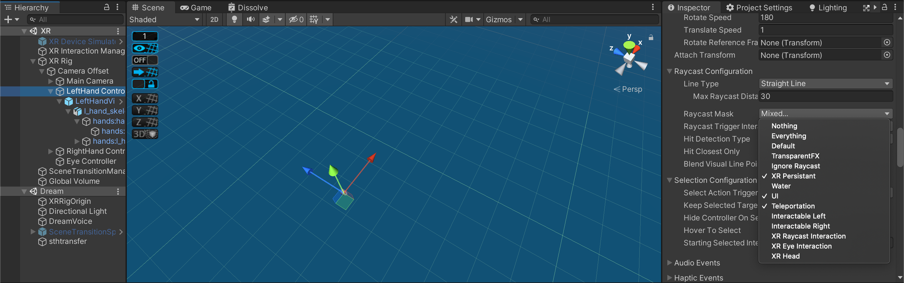
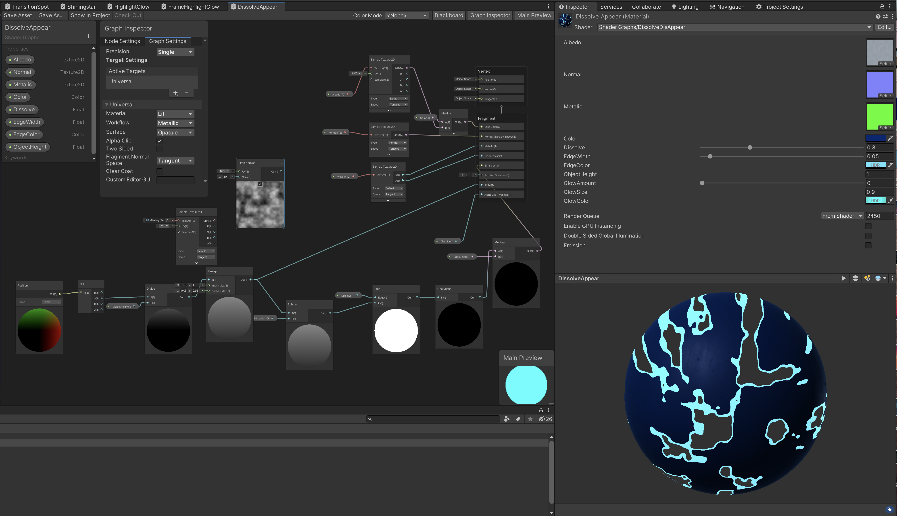

# Royal Choice

Alternate Realities Project by Marta Pienkosz and Jasmin Shi. 


**Strongly Recomended**
If you have a VR headset, do not hesitate to play our project on it. Here is the [release](https://github.com/JasminShi/ALTR_Project3/releases/tag/v1.0.0-Alpha)

**Recommended**
If you don't have a VR headset right now, you can [watch this](https://drive.google.com/drive/folders/19y-PMIfJmgaNyEj64rDgOtt2YUMZ7ASr?usp=sharing), which is a video walkthrough of the VR experience. 

Below are some general visual aesthetics of the game. 


## Worldbuilding
The main character of the story is a little princess, a member of the royal family. The royal family is elected by **dynastic and divine laws** and has partial immortality. Rulers are able to live up to 300 years, guaranteeing long-term prosperity and justice to their subjects.
 
The theme communicated by history revolves around the age-old moral dilemma - what's better, do a **good thing for a bad result** or do a **bad thing for a good result?**
 
 
## Plot
The little princess wakes up in her chamber. At the beginning of the story, we learn about the identity of the princess and her role in the royal family. Suddenly we hear a sound resembling a bird crying and together with the princess we decide to follow the sound and investigate where it comes from. The princess leaves her room and moves down the corridor towards the basement of the castle. The sound of flapping birds' wings intensifies.
 
In the basement, she discovers a room full of cages and learns that a special serum is obtained from magical birds. The princess realizes that she consumes a drink that grants “immortality” every day. She talks to an employee who explains the king's logic behind abusing the birds. Confused, she doesn't know what to do - she is faced with the decision to release the birds and expose the king's secret, or keep this information to herself.
 
 
## Progress
After brainstorming the project idea, we wrote a brief list of features we want to develop over the next 7 weeks, agreed on the order of implementation and minimal requirements for the MVP. 

[Project Proposal](https://docs.google.com/presentation/d/11PQFCiBJaEqtsZIy5RAeAoMv4BO3j1rK7nELosP6U7Q/edit?usp=sharing) can be viewed here. 
[ALTR_Project 3](https://docs.google.com/document/d/1HIzR-mnUKxKZD01efXmYryBfXu3IYQbWYmGtPyJ70Kk/edit?usp=sharing) is a link to the detailed documentation of the 7-week progress.  

[The Plot Design for Royal Choice](https://docs.google.com/document/d/1Q0Mhou8_hozDh8bwGm4f6z0P6WRqtUP74pePDs9ogl4/edit?usp=sharing)

Marta started our project by creating her own resources using [Shapr3D Software](https://www.shapr3d.com/)for each scene. Jasmin worked in parallel on the Github Collaborate and XR Rig setup, as well as creating scene transitions. 


## Lobby
We have implemented a simple UI system in the lobby that shows the title, authors, and a brief instruction. We have designed the user path in a way that the user can learn to navigate in a VR environment, try the SnapTurn on turns, test RayCast interactions, and learn about the transitions between scenes that occur when the user stands on an emissive star.


## Dream
We start the story from the user waking up from a dream. Therefore, we implemented a scene which has very dark environment and the audio of birds' crying and calling played in the background. The user can not decide when to leave the scene, which is similar to a dream scenario. We implemented a script that fades the screen and transit to the next scene once the audio is finished playing. 


```
using System.Collections;
using System.Collections.Generic;
using UnityEngine;
using UnityEngine.Events;

public class DreamTransfer : MonoBehaviour
{

    public UnityEvent OnFinished = new UnityEvent();

    public AudioSource dreamAudio;

    public void Update()
    {
       if(!dreamAudio.isPlaying)
        {
            OnFinished.Invoke();
        }
    }
}

```


## Bedroom
After the user wake up from the dream, they immediately hear the voice of the bird NPC which instructed her to reflect on her dream and lead her to the journey of explorinig the secrets behind her dream. Interactions are designed to instruct the users to move forward and get a better understanding of the background of the story. 


The main interactions are: 

1). The user grasps and drinks the glass of magic baverage on the table. There are swallowing sounds and the baverage would disappear after "drinking" action.


2). The user looks at the portraits and the background story audio of each portrait plays. We use eye-centered interaction here so that the portraits' frames will be highlighted once the user focus on one portrait. The portraits are designed to play one by one and the user can not activate the next portrait unless the current portrait's audio is finished playing. 
This is realized through the [Portrait Manager](https://github.com/JasminShi/ALTR_Project3/blob/main/Assets/Scripts/Bedroom/PortraitManager.cs)script. 
The XR Eye-centered interaction is not enabled unless the previous event is finished. 

Below is the settings in Unity. 


3). The bird NPC walks from the table to the portraits and to the exit of the bedroom, which is scripted to walk as the story progresses. The bird NPC would turn to the user when speaking and idle when not moving. 

This is realized through [BirdController](https://github.com/JasminShi/ALTR_Project3/blob/main/Assets/Scripts/Bedroom/BirdController.cs) script.

Bird Facing position/rotation Control script: 
```
    IEnumerator PlayBirdDialogue3()
    {
        yield return WaitForBirdToReachDesitnation();

        transform.LookAt(userLocation.position, Vector3.up);

        birdDialogue3.Play();

    }

```


Jasmin designed the layout of the chamber and the portraits, while Marta built the assets of the chamber.


Marta designed the Bird NPC and added animations using mixamo.


 
## Corridor
The corridor scene serves as a transition between the two narrative driven scenes. In this scene, we wanted the users to immerse themselves in the game's environment and aesthetics, while also trying to strengthen their sense of anticipation and curiosity. After adding the custom assets, we started scripting the movement of the platforms, which activates when the user stands on the emissive star. Marta encountered difficulties detecting collisions between the XR Rig and the Box colliders. After some time we changed the logic behind this interaction and added Teleport Anchor along with the Hover Exited events. We also created a custom Shader Graph for water, as well as added an element of fog, subtle sounds of earthquake and water to further enhance the sensational feeling.


 
## Prison


The Prison scene leads the user to the climax of the story through realizing the sharp conflict between the prosperity of the kingdom and the lives of the birds. The user first sees plenty of birds inside the "cages" of the prison and then walks ahead and hears one lab report from the automatically played audio. The audio is played once the user steps into the area, which is designed forseeing the user's traffic flow. Next, the user would see an exit to the left, where the user encounters the guard of the prison.  


 
The user is further told by the guard NPC that the king keeps the birds for a greater good, which is directly the opposite of how the user feels when going through all the scenes witnessing the sufferings of the birds. Therefore, the moral dilemma is delivered here and pushes the story to a climax. The user is instructed to make a choice, seeing the two columns standing in front of her. The user has to choose by grabing each of the objects, which will lead to two different but similar ending.

Both endings explains the losses and gains of each side through the form of debate from the bird and the guard. The ending illustrates that there is no good choice in such a moral dilemma and we intend to let the user feel sorry and reflect on the past experience. 

There are many interactions in this scene as well. 

1. The guard NPC and the lab report are triggered once the user steps into a certain trigger area. 
2. The user can choose to proceed without listening to the full audio of each speaker as they are also encouraged to make an uninformed decision(which makes no difference to the ending). Therefore, the audio would stop playing once the user interacts with the next object.
3. The NPC faces the user and follows the user wherever the user goes using the [NPC Controller](https://github.com/JasminShi/ALTR_Project3/blob/main/Assets/Scripts/Prison/NPCController.cs).
4. The user grabs either of the bird or the NPC which triggers the following three actions: 


a. Bird Ending:


  1. The birds in the prison **dissolve** showing that the birds are freed.
  ```

    IEnumerator Dissolve(float target)
    {
        nPCController.npcDialogue.Stop();
        while (!Mathf.Approximately(currentDissolveAmount, target))
        {
            birdFinalEnding.Play();
            currentDissolveAmount = Mathf.MoveTowards(currentDissolveAmount, target, speed * Time.deltaTime);
            dissolveMaterial.SetFloat("_DissolveAmount", currentDissolveAmount);
            yield return null;
        }
        crown.SetActive(false);

        StartCoroutine(waitForAnimationToEnd());
        XRSceneTransitionManager.Instance.transitionSpeed = 1.0f;
        StartCoroutine(XRSceneTransitionManager.Instance.Fade(1.0f));

        StartCoroutine(waitForbirdFinalEndingToEnd());

    }

     IEnumerator waitForAnimationToEnd()
    {
        yield return new WaitForSeconds(1);

    }

    ```


  2. The scene fades to black and the bird that the user chooses is persistant.

  3. The bird ending audio is played.

  4. After the bird ending audio is finished, the scene transits to the Lobby scene.

  ```

    IEnumerator waitForbirdFinalEndingToEnd()
    {
        yield return new WaitForSeconds(birdFinalEnding.clip.length);
        //FrameHighlight.StopHighlight();
        OnFinished.Invoke();
       
    }

    ```


b. Crown Ending: (Similar to bird ending in setting up)


  1). The birds in the prison are **shining and highlighted**, which represents the exploitation of the birds intensifies as the power of kingdom strengthens. 

  2). The scene fades to black and the crown that the user chooses is persistant.

  3). The crown ending audio is played.

  4). After the bird ending audio is finished, the scene transits to the Lobby scene.

## Teleportation 
Every scene except for the Dream Scene have telportation areas included, which is built by probuilder. We use left hand trigger to teleport, therefore, the interaction layer mask is set to teleportation & UI & XR Persistent. The teleportation area is on the teleportation layer and the hand visuals are on the XR Persistent layer. 
 

The reticle of teleportation also meets the aesthetics of the whole design, which is one of our favourite designs. 


## Scene Transition & Editor
Most of the scene transition (Except for the Dream scene to Bedroom Scene) are realized through standing on a transition spot. It is a star-like spot that users can teleport to.
 
We use a **teleportation anchor** to realize such function.
 

The [SceneTransition Manager](https://github.com/JasminShi/ALTR_Project3/blob/main/Assets/Scripts/XRSceneTransitionManager.cs) script completes the loading and unloading of different scenes and the [SceneTransition Controller] (https://github.com/JasminShi/ALTR_Project3/blob/main/Assets/Scripts/XRSceneTransitionController.cs) script controls which scene to transit to.

For easier management of  different scenes, we also included two scripts that shows the scenes in editor. The scripts are [SceneSelector](https://github.com/JasminShi/ALTR_Project3/blob/main/Assets/Scripts/Editor/SceneSelector.cs) and [SceneTransferEditor](https://github.com/JasminShi/ALTR_Project3/blob/main/Assets/Scripts/Editor/SceneTransferEditor.cs). 

For **Screen Fade effect**, here is the setting: 
 

## Navigation
In Bedroom Scene and Prison Scene, the NavMesh Agents (NPCs) have their own navigation maps. 
 

## Shader: *Glow/Highlight/Dissolve*
We all use one similar script which is changing the property amount with a certain speed in a certain time. Below is the main functon script. 
```

 IEnumerator Highlight(float target)
    {
        while (!Mathf.Approximately(currentHighlightAmount, target))
        {
            currentHighlightAmount = Mathf.MoveTowards(currentHighlightAmount, target, highlightspeed * Time.deltaTime);
            highlightMaterial.SetFloat("_GlowAmount", currentHighlightAmount);
            yield return null;
        }
             
    }
 ```
Below are the 6 shaders that we have made for this project. We have our reference linked in the [detailed documentation doc](https://docs.google.com/document/d/1HIzR-mnUKxKZD01efXmYryBfXu3IYQbWYmGtPyJ70Kk/edit?usp=sharing). 
 
 
 
 
 
 

## Sounds
Marta processes most of the audio in the story using [Audacity](https://www.audacityteam.org/). 


Special Thanks to **Kacper Jarco** for the voiceover. The rest of the voiceovers are done by Jasmin & Marta. 

 
 
## Lighting

Jasmin designs most of the lighting in the scenes. We have difficulty lighting up the interior scene like the bedroom and the prison. The major issue is that since we designed all of our assets by ourselves, Unity has difficulty recognizing the UV maps on the assets, which leads to uneven and strange baking lightmaps. The solution to this problem is to add more spotlights in the area which has a very wide range so that it lights up the room interiorly. 

 

The other important lesson learned is that we should never bake the lights when loaded two scene. Baking the lights for one scene with an XR scene active is so common and so deadly for the lightings in other scenes. Therefore, definitely avoid that. Jasmin has also spent time lighting up the portraits in the bedroom scene and modifies the environement light in every scene so that the colors of the assets meet our original mood pallette.

Thanks to the following tutorial video:   

Ambient Occlusion might add the shining effect of the lights but does not work well when I have a lot of emmisive materials. 


Jasmin added fog effects in Corridor and Prison scene to give a more mysterious vibe into the storytelling.  


## Playtesting Feedbacks from Users

First User: 

- Aesthetics: consistent, like the color.
- Sound in the bedroom: too much echo, too low, can not hear clearly. 
- The interactions in the corridor scene: Fun experience.  
- The Frame color of the portraits in the room are a bit weird. 

Second User: 

- The storytelling in the bedroom is not very clear. 
- The glass on the table is a bit confusing. 
- The user would like to know what to do with the glass. 
- The castles' speed could be more gentle. 
- The ending is still a bit vague.

Third User: 

- Love the castles.
- Love the monument valley vibe. 
- Looking forward to the ending design. 


## Challenges

We have encountered so many challenges along the 7-week way building our project that we can not remember all of them. We are glad that we have overcome most of them and are able to present a complete and interesting project. In general, there are chellenges in **scripting, debugging and lighting**. 

We are not familiar with implementing Coroutines in our scripts at first. There are challenges to make the NPC and the user interact by creating signs to instruct the users and giving feedbacks when the action is completed. We implemented the UnityEvent system which sets up the next action using *OnFinished()* Function. We become familiar with calling public functions across scripts and adding the scripts to certain game objects. Lesson learned here is that practice does help make perfect. We are able to write up scripts to realized functions like **screenfade after audio is played**, **actioncalled after interaction entered**, **Disable Game objects after interaction exited**, etc. We are able to write the script by ourselves when the project is approaching to the end, which enhances the sense of acomplishment in completing the project. 

We are confused with how to debug a project at first. But debugging with the professor for many times and struggling through and learning from the mistakes really help us develop the **sense of debugging**. When we see something working abnormally, we have the directions to find out what is wrong. I have to say, that there are times when we spend 2 hours and everything stays the same. But the time spent is worth it as we memorize what we did wrong and could improve in the future. Although we are still lacking the ability to look through the terminal and debug, we have improved in debugging within Unity. 

Jasmin has encountered lighting problems. The project has endured three stages as for the lighting. First Stage, looking great without any bake lights and under directional lights. Second Stage, looking poor resolution, far from our original aesthetics, creepy shadows, ugly and strange colors after baking lightmaps. Both Realtime and baked lights are not satisfying. Jasmin has spent hours trying to adjust the lights through building on Windows PCs, going through different Unity Lighting tutorials, asking professors for help. Jasmin has exlored every tab and button in the lighting section in Unity, which did not help with the final fix, but helped familiarize with the different lighting settings. In the final Project, the lighting is adjusted through countless testing and some luck.

 
## Final Thoughts
> It was a Mission Impossible at first

This is the first time for us to do a 7-week project. We are grateful to heve the opportunity to complete such a **mission impossible**, both struggled and enjoyed the project experience. For such a project, it is not only about Unity itself, but about storytelling, sound design, visual design, 3D modelling, video editing, user experience design and so forth. Other than Unity, we have also used other modelling or visualization/audio software to make our storytelling more vivd and immersive. 

> Group Dynamics are essential

For Marta and Jasmin, it is our first time collaborating with  each other. We collaborated well in this group project, nicely analyzed the project expectations, group workflow, adjusted the working plan weekly and appreciated each other's works. Marta is good at targeting the works to fufill the minimal viable project while Jasmin is good at planning the steps ahead. We tried to make the best out of our project with the easiest way. We emphasize on the user experience while using Unity and many other tools to tell the story. 

> Don't Hesitate to Seek Help

We admit that we might not be the best in scripting in C# or building in Unity, however, we actively seek help both through watching tutorials on Youtube, asking classmates for advice, or making office hour appoitnments with the professor. We can not complete our project without the great help offered by them. Special thanks to Professor Michael Allison. He is the greatest supporter behind this project. :)

> Glad we rushed ahead of time

During the project building season, we managed to rush ahead of the plans so that we could save more time for polishing the project. Experience teaches us that here must be some time reserved for debugging. There is one time when every interaction in our project did not work one week before presentation. We are glad that we left some time for dealing with the erros and bugs and that did not happen on the day of presentation. 


Contact Us: js11168@nyu.edu 

